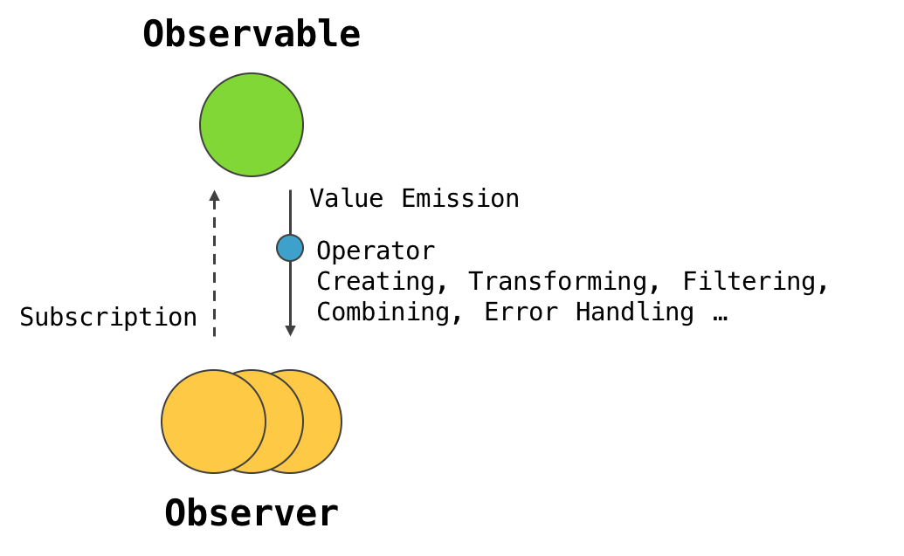

# ReactiveProgramming
<ol>
  <li>리액티브 프로그래밍이란</li>
  <p>
    리액티브 프로그래밍은 비동기 데이터 스트림에 기반을 둔 프로그래밍 패러다임입니다.<br>
    혹은, 데이터 흐름과 변화에 대한 전파에 중점을 둔 프로그래밍 패러다임이라고 할 수 있습니다.<br><br>
    * 프로그래밍 언어로 정적 또는 동적인 데이터 흐름을 쉽게 표현할 수 있어야하며, 데이터 흐름을 통해 하부의 실행 모델이 자동으로 변화를 전파할 수 있는 것을 의미합니다.<br>
    * 데이터 스트림이란 연속적인 데이터의 흐름을 말하며, 리액티브 프로그래밍에서는 모든 것을 데이터 스트림으로 봅니다.<br><br>
    기존 프로그래밍 방식은 배열과 함수 반환값과 같은 동기 데이터를 처리하는 방식과, Ajax 통신이나 사용자 이벤트와 같은 비동기 데이터 처리 방식이 제각각 나뉘어 있었습니다.<br>
    하지만 리액티브 프로그래밍에서는 동기 및 비동기와 관계없이 데이터를 생산하는 것이라면 무엇이든 <b>시간축을 따라 연속적으로 흐르는 데이터 스트림으로 처리합니다.</b><br><br>
    리액티브 프로그래밍은 다양한 데이터를 데이터 스트림이라는 하나의 일관된 형식으로 만들고, 이 데이터 스트림을 <b>구독(subscribe)</b>하여 데이터 스트림의 반응하는 방식으로 동작하는 어플리케이션을 작성하는 것을 뜻합니다.
  </p>
  <li>TV 방송국과 TV의 관계</li>
  <p>
    둘의 관계를 살펴보며 이해를 돕겠습니다.<br><br>
    일단, TV 방속국은 영상 정보를 가지고 있습니다.<br>
    이 영상 정보는 프레임으로 이루어진 정지된 사진들의 집합이며, 프레임은 시간을 축으로 하여 연속적으로 흐르는 데이터 스트림이라고 할 수 있습니다.<br><br>
    TV는 방송국의 영상 정보를 획득하여 화면에 표시를 해줘야 하는데, 그 방법은 크게 두 가지로 나눌 수 있습니다.<br><br>
    1. TV가 방송국에 영상 정보 프레임을 계속해서 요청하여 획득하는 방법<br>
    <span style="padding-left: 16px"></span>우리는 이를 풀 시나리오 (Pull Scenario) 라고 얘기하며, 어플리케이션이 외부 환경에서 데이터를 당겨오는 방식을 의미합니다.<br><br>
    2. TV 방송국은 일정 시간 단위로 영상 정보의 프레임을 계속해서 방출 (Emit) 하고, TV는 이를 관찰하고 있다가 새로운 영상 정보 프레임을 방출하면 이를 획득하는 방법<br>
    <span style="padding-left: 16px"></span>우리는 이를 푸시 시나리오 (Push Scenario) 라고 얘기하며, 어플리케이션이 외부 환경을 관찰하고 있다가, 외부 환경이 데이터 스트림을 방출하면 반응하여 데이터를 획득하는 방식을 의미합니다.<br><br>
    리액티브 프로그래밍은 바로 이 두 가지 방식 중, 푸시 시나리오로 동작하는 어플리케이션을 작성하는 것을 말합니다.<br>
    여기서 우리는,<br><br>
    1. 옵저버블 (Observable): 데이터 스트림을 생성하고 방출하는 객체<br><br>
    2. 옵저버 (Observer): 옵저버블이 방출한 노티피케이션 (Notification: 옵저버블이 방출할 수 있는 푸시 기반 이벤트 또는 값) 을 획득하여 사용하는 객체<br><br>
    위와 같이 2가지의 중요 개념을 정리할 수 있습니다.<br><br>
    TV 방송국과 TV를 이 두 가지 개념으로 정리해보자면, 데이터 스트림을 방출하는 TV 방송국은 옵저버블, 데이터 스트림(영상 정보 프레임)은 옵저버블이 방출한 노티피케이션, TV는 옵저버라고 말할 수 있습니다.<br><br>
    
  </p>
</ol>


## ObserverPattern
옵저버 패턴은 디자인 패턴의 일종으로써, 한 객체의 상태가 바뀌면 그 객체에 의존하는 다른 객체들 역시 자동으로 내용이 갱신되는 방식을 의미합니다.<br>
아래 유튜브를 예시로 든 코드 역시 옵저버 패턴을 기반으로 작성되었습니다.
### Example Code
```typescript
type TMessage = {
  message: string;
};

function ownForEach<T> (array: T[], predicate: (value?: any, index?: number, predicateArray?: T[]) => any) {
  if (!Array.isArray(array)) {
    return [];
  }

  const arrLeng = array.length;

  if (!arrLeng) {
    return [];
  }

  let idx = 0;

  while (idx < arrLeng) {
    predicate(array[idx], idx, array);
    idx += 1;
  }
}

class YoutubeChannel {
  private _subscribedUsers: Observer[] = [];
  protected _state: TMessage = {
    message: ''
  };

  // Observer 등록(구독)
  addSubscriber(observer: Observer) {
    this._subscribedUsers = [...this._subscribedUsers, observer];
    console.log('- 유튜브 채널 구독 완료 -', observer);
    console.log('- 현재 채널 구독자 리스트 -', this._subscribedUsers);
  }

  // Observer 삭제(구독 해지)
  removeSubscriber(observer: Observer) {
    this._subscribedUsers = this._subscribedUsers.filter(o => o !== observer);
    console.log('- 유튜브 채널 구독 해지 -', observer);
    console.log('- 현재 채널 구독자 리스트 -', this._subscribedUsers);
  }

  // 구독한 모든 observer의 update 메서드를 호출하여 데이터를 전파
  protected notify(state: TMessage) {
    ownForEach(this._subscribedUsers, o => {
      console.log(`${o.constructor.name} 구독자에게 알림을 전파한다!`, state);
      o.update(state);
    });
  }
}

class MyYoutubeChannel extends YoutubeChannel {
  // 구독한 모든 observer에게 알림 메시지를 전파
  setMessage(message: string) {
    this._state.message = message;
    this.notify(this._state);
  }
}

abstract class Subscriber {
  abstract update(message: TMessage): void;
}

class CadenSubscriber extends Subscriber {
  update(message: TMessage) {
    console.log(`구독자 ${this.constructor.name}에게 알림이 도착하였다!`, message);
  }
}

class DayzenSubscriber extends Subscriber {
  update(message: TMessage) {
    console.log(`구독자 ${this.constructor.name}에게 알림이 도착하였다!`, message);
  }
}

const PewwwTV = new MyYoutubeChannel();
console.log('- PewwwTV -', PewwwTV);

const caden = new CadenSubscriber();
const dayzen = new DayzenSubscriber();

// 구독
PewwwTV.addSubscriber(caden);
PewwwTV.addSubscriber(dayzen);

// 데이터 전파
PewwwTV.setMessage('구독자분들 환영합니다!');

// 구독 취소
PewwwTV.removeSubscriber(caden);

// 데이터 전파
PewwwTV.setMessage('비록 1명 뿐이지만 환영합니다..!');
```

### Result in Console


### Explanation
Hi, How are you